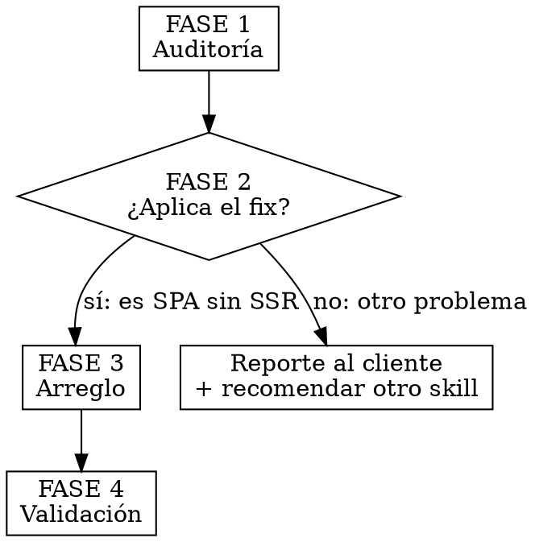

# SEO SPA Rescue — Auditar y Arreglar la Indexación de cualquier web

> **Este es EL skill que se corre en cualquier sitio de cliente con problemas de
> indexación.** Audita primero, luego arregla. Reemplaza a los 5 skills SEO
> anteriores (archivados en `../_archivo/`).

## Qué es esto

Un playbook de 4 fases para diagnosticar y resolver el problema de indexación más
común en los sitios de la agencia: **webs construidas como Single Page Application
(SPA) que le entregan a Google el mismo HTML en todas sus páginas**, y por eso no
se indexan. Validado en producción con Veritas Medical Group y Healing Minds
Psychiatry — ambos el mismo stack (React + Vite + Express en Replit).

**Principio raíz:** una SPA renderiza el contenido en el navegador con JavaScript.
La primera lectura de Google (y de Bing, bots de IA, previews sociales) ve el HTML
*antes* de ejecutar JS — una plantilla vacía idéntica para toda ruta. Google ve N
páginas que parecen copias, las marca como duplicados y no las indexa. **No es una
penalización; es un fallo de comunicación técnica.** El fix es renderizar la
metadata y el contenido por ruta *en el servidor*, antes de que React hidrate.

## Cuándo usar

- Search Console reporta cualquiera de: *crawled/discovered - currently not
  indexed*, *duplicate without user-selected canonical*, *Google chose different
  canonical*, *soft 404*, *page with redirect*.
- `curl` de varias URLs internas devuelve el mismo `<title>` / mismo HTML.
- El cliente dice "no aparezco en Google" o "perdí posiciones".
- Previews de WhatsApp/Facebook muestran la imagen del home en páginas internas.
- **Pre-onboarding / pre-keyword-research / pre-rediseño** de cualquier cliente con
  web viva — correr al menos la Fase 1 como baseline.

## Cuándo NO usar

- Cliente sin web.
- Web en plataforma all-in-one con SEO gestionado (Squarespace, Shopify,
  WordPress.com Business) — la mayoría de hallazgos no aplican.
- Problema de SEO de *contenido* (títulos, textos, enlaces internos, densidad de
  keywords) sin problema de indexación → ese es otro trabajo, no este skill.

## El flujo: 4 fases

**Regla dura: nunca saltes a la Fase 3 sin haber hecho la Fase 1.** No se arregla
lo que no se diagnosticó. El arreglo modifica el código de producción del cliente;
hacerlo a ciegas rompe sitios.

---

## FASE 1 — Auditoría

**Objetivo:** sondear el sitio en vivo, clasificar los síntomas, detectar el stack,
y producir un diagnóstico (y opcionalmente un PDF para el cliente).

Carga la referencia completa: **`references/01-auditoria.md`**. Resumen:

1. **Sondea producción** con la batería de ~12 probes (curl o PowerShell) con
   user-agent de Googlebot: host www/apex, http/https, canonical en HTML inicial,
   tamaño de contenido por ruta, title por ruta, soft 404, sitemap, robots.txt,
   hreflang, headers.
2. **Detecta el stack**: ¿SPA? (`
` + body inicial pequeño) ¿SSR?
   ¿framework? (`X-Powered-By`, `Server`, rutas `/_next/`) ¿Replit? (`Server:
   Google Frontend` + `X-Powered-By: Express`).
3. **Clasifica** cada categoría de Search Console contra su causa raíz — usa la
   tabla de mapeo de `01-auditoria.md`.
4. **La prueba decisiva**: pide el HTML inicial de 3+ rutas internas distintas y
   una URL inventada. Si todas devuelven el mismo `<title>` y un cuerpo de tamaño
   idéntico → SPA sin SSR confirmada (P0 crítico).
5. **Entregable**: diagnóstico en markdown. Si el cliente lo necesita, genera el
   PDF profesional con la plantilla de `01-auditoria.md` (skill `pdf`).

**Salida de la Fase 1:** una lista de hallazgos P0/P1 y una respuesta clara a "¿me
penaliza Google?" (casi siempre: no).

---

## FASE 2 — Decisión: ¿aplica el fix?

| Lo que encontró la Fase 1 | Acción |
|---|---|
| SPA sin SSR, HTML idéntico por ruta, stack Vite+React+Express (Replit) | **Fase 3** con el playbook completo |
| SPA sin SSR pero stack distinto (Next.js, Astro, Remix, Vue) | **Fase 3** adaptada — ver "Otros stacks" en `02-fix-playbook.md` |
| Solo problemas menores (sitemap viejo, bug `:443`, trailing slash) y el contenido SÍ se renderiza server-side | Fase 3 parcial — solo los snippets puntuales que apliquen |
| Web estática / SSR ya correcto / plataforma gestionada | NO aplica. Reporte al cliente y, si el problema es de contenido, recomienda el skill de SEO de contenido |

**Antes de la Fase 3, REGLA DE ORO:** comparte el diagnóstico con el equipo de
desarrollo del cliente. La auditoría externa ve el síntoma; el dev team suele
conocer un fix más simple. En Veritas, el equipo ya tenía un middleware que
inyectaba `canonical` por ruta — extenderlo resolvió el 80% sin migrar de stack.
Documenta OPCIONES, no UNA solución definitiva, hasta hablar con ellos.

---

## FASE 3 — Arreglo

**Objetivo:** dejar el código corregido para que el servidor entregue metadata y
contenido por ruta.

Carga la referencia completa: **`references/02-fix-playbook.md`**. Cubre las
Fases 0–3 del prerender server-side, validadas con Veritas:

- **Fase 0** — Host canónico: `www → apex` (o apex → www) y `http → https` en un
  solo salto 301. Incluye el fix del bug `:443` que inyecta Replit.
- **Fase 1** — Inyección SSR de meta por ruta: registro `ROUTE_META`, middleware
  Express que bufferiza el HTML y reescribe `<title>`, description, `og:*`,
  canonical, hreflang y JSON-LD antes de `</head>`.
- **Fase 2** — Prefijos de idioma `/es/*` `/en/*` (si el sitio es bilingüe).
- **Fase 3** — Regeneración del sitemap con `<lastmod>` fresco.
- **Bugs incluidos**: URLs fantasma → 404 real + `noindex`; JSON-LD healthcare con
  `MedicalBusiness` y nombres de aseguradora limpios.

### Cómo se aplica el fix en Replit ("tú haz todo")

El fix toca archivos del repo del cliente (`server/index.ts`, `client/index.html`,
etc.). Como esos repos viven en Replit, la Fase 3 **no edita nada directamente**:
genera un **paquete de instrucciones autocontenido** que se sube a Replit y el
Agente de Replit ejecuta.

Carga **`references/03-replit-handoff.md`** y sigue su plantilla para producir
`replit-fix-brief.md` — un único archivo, ya personalizado con el dominio, el host
canónico, la lista de rutas y el stack detectados en la Fase 1. Jordan lo sube al
Replit del cliente y el Agente de Replit lo aplica. Cero edición manual.

> Si en algún caso SÍ se tiene acceso directo al repo (Claude Code corriendo dentro
> del Replit, o repo conectado a GitHub), el mismo `02-fix-playbook.md` sirve como
> guía de implementación directa — aplica los cambios y salta el handoff.

---

## FASE 4 — Validación

**Objetivo:** comprobar con evidencia objetiva que el fix funcionó, antes de tocar
Search Console.

1. **Re-sondea producción** con la batería de la Fase 1. Criterios de éxito:
   - Title y tamaño de cuerpo **distintos** entre 3 rutas internas.
   - URL inexistente → `HTTP 404` (no 200).
   - Redirect `http→https` sin `:443`.
   - `og:url` por ruta = canonical.
   - `<lastmod>` del sitemap = hoy.
2. **Search Console**: reenviar sitemap → *Validar corrección* en cada categoría
   de error → *Inspección de URL* + *Solicitar indexación* en 5–10 páginas
   prioritarias → reconfirmar que no hay acciones manuales.
3. **Expectativa**: validación 1–3 días; reindexación completa 2–4 semanas.

Checklist completo de GSC en `references/01-auditoria.md` (sección "Validación").

---

## Referencia rápida

| Síntoma | Fase | Dónde está la solución |
|---|---|---|
| "No sé qué tiene la web" | 1 | `references/01-auditoria.md` |
| HTML/title idéntico en todas las rutas | 3 | `02-fix-playbook.md` §Fase 1 |
| www y apex ambos 200 / canonical duplicado | 3 | `02-fix-playbook.md` §Fase 0 |
| Redirect http→https con `:443` | 3 | `02-fix-playbook.md` §Fase 0 |
| URL inventada devuelve 200 (soft 404) | 3 | `02-fix-playbook.md` §URLs fantasma |
| Sitio bilingüe sin hreflang / mismas URLs | 3 | `02-fix-playbook.md` §Fase 2 |
| JSON-LD genérico `Service` en páginas médicas | 3 | `02-fix-playbook.md` §Healthcare schema |
| Sitemap con fechas viejas | 3 | `02-fix-playbook.md` §Fase 3 |
| Hay que entregar el fix a Replit | 3 | `references/03-replit-handoff.md` |
| Reporte PDF para el cliente | 1 | `references/01-auditoria.md` §Plantilla PDF |

## Errores comunes

- **Saltar a la Fase 3 sin auditar.** Rompes sitios. La Fase 1 no es opcional.
- **Recomendar migrar de framework antes de hablar con el dev team.** Casi siempre
  hay un fix 10x más simple extendiendo lo que ya existe. Documenta opciones.
- **Confundir indexación con penalización.** Estos problemas NO son una acción
  manual de Google. Verifícalo: GSC → Seguridad y acciones manuales.
- **Auditar con un scraper que ejecuta JS.** Tavily/Lighthouse ejecutan JavaScript
  y "ven" contenido que Googlebot no ve en su primera pasada. Usa `curl` con UA de
  Googlebot para ver el HTML INICIAL crudo.
- **Validar el fix mirando solo el navegador.** El navegador ejecuta JS. Valida con
  `curl` contra producción.
- **Editar el repo del cliente sin pasar por el handoff de Replit** cuando no
  tienes acceso confirmado al repo. Genera el brief y que lo aplique Replit.

## Notas de consolidación

Este skill reemplaza y unifica:
- `seo-indexing-audit` → Fase 1 + Fase 3
- `gsc-canonical-www-fix` → Fase 0 del fix-playbook
- `spa-seo-phantom-urls` → URLs fantasma + healthcare schema del fix-playbook
- `spa-seo-prerender` → núcleo del fix-playbook (Fases 0–3)
- `inpulza-site-architecture-seo-audit-methodology` → Fase 1 (auditoría + PDF)

Los originales están en `../_archivo/` solo como histórico. **No los uses; usa
este.**
